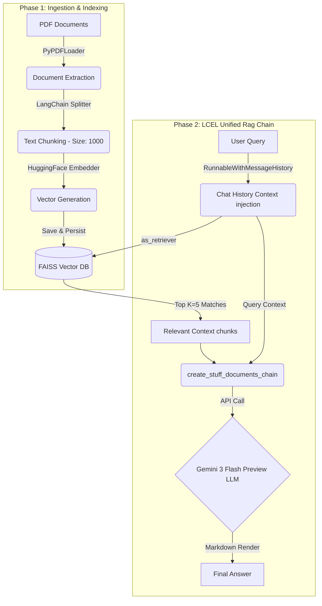

# RAG Implementation with LangChain

This project implements a Retrieval Augmented Generation (RAG) system that uses PDF documents as a knowledge base and the Gemini API to generate formatted Markdown answers.

[](https://www.python.org/)
[](https://www.langchain.com/)
[](https://github.com/facebookresearch/faiss)

**Focus:** PDF ingestion, semantic retrieval, and Gemini-powered answers via a CLI workflow.

**Highlights:** Fast local retrieval with FAISS, conversational context, and a clean UI for PDF uploads.

## Contents

- [Features](#features)
- [Project Structure](#project-structure)
- [System Architecture](#system-architecture)
- [Setup](#setup)
- [Usage](#usage)
- [Configuration Parameters](#configuration-parameters)
- [To Do / Potential Improvements](#to-do--potential-improvements)
- [Contributing](#contributing)

## Features

*   **LangChain LCEL pipeline:** Unified orchestration with standard LangChain abstractions.
*   **Native document ingestion:** PDF parsing mapped directly into `Document` objects with `PyPDFLoader`.
*   **Conversational memory:** Context-aware `RunnableWithMessageHistory` for follow-up questions.
*   **Semantic text splitters:** Configurable chunking with `RecursiveCharacterTextSplitter` to balance context and precision.
*   **Vector embeddings:** Open-source `sentence-transformers` with a FAISS vector store.
*   **Answer generation:** Google Gemini via LangChain, configured from `MODEL_NAME` in `.env`.


## Project Structure

```
RAG-implementation/
├── data/                     # Recommended location for source PDFs
├── index_store/              # FAISS index files and text chunks
│   ├── faiss_index.idx
│   ├── text_chunks.json
│   └── faiss_index/
│       └── index.faiss
├── src/                      # RAG pipeline implementation
│   ├── chunking.py
│   ├── embedding.py
│   ├── generation.py
│   ├── ingestion.py
│   ├── retrieval.py
│   └── utils.py
├── main.py                   # CLI indexing/querying
├── requirements.txt          # Python dependencies
└── README.md                 # Project documentation
```

## System Architecture

This section outlines the architecture, pipeline flow, and software stack used in the implementation.

### Technology Stack & Libraries

The system is built primarily around the LangChain ecosystem to orchestrate the pipeline.

*   **Framework:** `langchain`, `langchain-community`, and `langchain-classic` with LangChain Expression Language (LCEL).
*   **User interface:** CLI pipeline (`main.py`).
*   **Document ingestion:** `PyPDFLoader` for PDF parsing into `Document` objects.
*   **Vector embeddings:** `sentence-transformers/all-MiniLM-L6-v2` via `langchain-huggingface`.
*   **Vector database:** `faiss-cpu` for local similarity search.
*   **Generation (LLM):** `gemini-3-flash-preview` via `langchain-google-genai`.
*   **Memory management:** `RunnableWithMessageHistory` for conversational context.

### The RAG Pipeline

The architecture is split into two distinct operational phases:

#### Phase 1: Ingestion & Indexing Pipeline (Offline/Upload Setup)

This phase transforms raw PDF data into a searchable local index.

    1.  **PDF Loading & Extraction (`src/ingestion.py`)**
     *   **Process:** PDF upload via a folder path via CLI.
    *   **Library:** `PyPDFLoader` parses PDF pages into LangChain `Document` objects.
    *   **Output:** List of `Document` objects with text and metadata.

2.  **Semantic Text Chunking (`src/chunking.py`)**
    *   **Process:** Raw text is split into semantic chunks to improve retrieval accuracy.
    *   **Mechanics:** `RecursiveCharacterTextSplitter`.
    *   **Configuration:**
        *   **Chunk Size:** `1000` characters.
        *   **Chunk Overlap:** `100` characters.
    *   **Output:** List of chunked `Document` objects with preserved metadata.

3.  **Vector Embedding & FAISS Store Generation (`src/embedding.py`)**
    *   **Process:** Text chunks are embedded into vectors.
    *   **Embeddings:** `HuggingFaceEmbeddings` with `all-MiniLM-L6-v2`.
    *   **Storage Index:** FAISS persists the vector index in `index_store/`.

#### Phase 2: Retrieval & Generation Pipeline (Online/Real-time Querying)

This phase takes a user prompt, retrieves relevant context, and returns the LLM response.

1.  **User Inquiry Processing (`app.py` / `main.py`)**
     *   **Process:** Query captured via CLI.

2.  **Query Embedding (`src/retrieval.py`)**
    *   **Process:** Query embedded using the same `all-MiniLM-L6-v2` model to match the index space.

3.  **Semantic Search (FAISS Retrieval)**
    *   **Process:** The vector store `as_retriever()` finds the top K=5 relevant chunks.

4.  **Generation Pipeline (`src/generation.py`)**
    *   **Process:** LCEL links context aggregation (`create_stuff_documents_chain`) and retrieval (`create_retrieval_chain`).
    *   **Memory:** `RunnableWithMessageHistory` injects prior turns into the chain.
    *   **Output:** The LLM generates the final answer from retrieved context.

### Architectural Data Flow Summary



## Setup

1.  **Clone the repository (if you haven't already):**
    ```bash
    git clone https://github.com/Abhishek-M-29/RAG-implementation.git
    cd RAG-implementation
    ```

2.  **Create a Python virtual environment (recommended):**
    ```bash
    python -m venv venv
    ```
    Activate it:
    *   Windows (PowerShell):
        ```powershell
        .\venv\Scripts\Activate.ps1
        ```
    *   macOS/Linux:
        ```bash
        source venv/bin/activate
        ```

3.  **Install dependencies:**
    ```bash
    pip install -r requirements.txt
    ```

4.  **Configure API Key:**
    The application loads the Gemini API key from environment variables using `python-dotenv`.

    Create a `.env` file in the project root and add your API key:
    ```env
    GEMINI_API_KEY="your_actual_google_gemini_api_key_here"
    ```
    *(Ensure this `.env` file is excluded from version control via `.gitignore`.)*

## Usage

You can use the RAG system through the Python CLI pipeline.

### Quick Start

```bash
python -m venv venv
pip install -r requirements.txt
```

### Using the Command Line Interface (CLI)

The `main.py` script provides a fallback/headless command-line interface.

#### Indexing Documents (CLI):
1.  Place your PDF files into a directory (e.g., `data/pdfs`).
2.  Run the pipeline:
    ```bash
    python main.py
    ```
3.  When prompted, enter `index`.
4.  Enter the full directory path where your PDFs reside. The script will extract documents, embed chunks, and generate a FAISS index.

#### Querying Documents (CLI):
Once your documents have been successfully indexed:
1.  Run the pipeline again:
    ```bash
    python main.py
    ```
2.  When prompted, enter `query`.
3.  Type your question and press enter. Type `exit` to stop. The answer is printed to the console.

## Configuration Parameters

`main.py` supports these primary configuration parameters:

*   `INDEX_PATH`: Default destination for FAISS (`index_store/faiss_index.idx`).
*   `CHUNK_SIZE = 1000`: Chunk length in characters.
*   `CHUNK_OVERLAP = 100`: Overlap between consecutive chunks.
*   `TOP_K_RESULTS = 5`: Number of retrieved chunks used for generation.
*   `MODEL_NAME = "gemini-3.1-flash-lite"`: Gemini model name loaded from `.env`.

## To Do / Potential Improvements

*   Add LLM key fallback and validation (multiple env keys, clear startup errors).
*   Enhance the CLI with flags for input paths, top-k, and model selection.
*   Add structured logging and retries around ingestion and LLM calls.
*   Build a dedicated frontend (React/Next.js) instead of Streamlit.
*   Add caching to skip re-indexing unchanged PDFs.

## Contributing

Fork the repository and open a pull request with a clear description of the changes.

