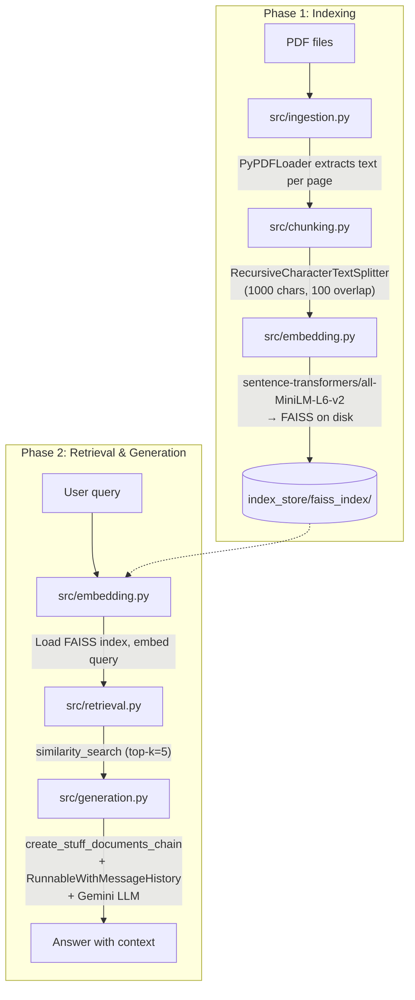
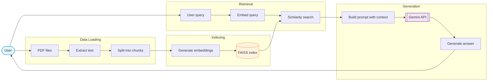

<div align="center">

# RAG CLI

**Local Retrieval-Augmented Generation over PDFs using LangChain & Gemini**

[](https://www.python.org)
[](https://www.langchain.com)
[](https://ai.google.dev)
[](https://github.com/facebookresearch/faiss)
[](LICENSE)
[](http://makeapullrequest.com)

[Features](#features) • [Quick start](#quick-start) • [Usage](#usage) • [Project structure](#project-structure) • [Architecture](#architecture) • [Configuration](#configuration) • [Development](#development) • [FAQ](#faq)

</div>

A command-line RAG system that lets you index PDF documents locally and ask questions in natural language. It uses **sentence-transformers** for embeddings, **FAISS** for vector search, and **Google Gemini** for answer generation. Conversation history is preserved within each session for follow-up questions.

> [!NOTE]
> This project runs entirely on your machine — no cloud infrastructure required. Embeddings use the local `all-MiniLM-L6-v2` model, and the FAISS index is stored on disk.

## Features

- **PDF ingestion** — Load and extract text from PDF files using `PyPDFLoader`
- **Semantic chunking** — `RecursiveCharacterTextSplitter` with configurable size and overlap
- **Local vector search** — `sentence-transformers` + FAISS for fast similarity retrieval
- **LLM-powered answers** — Google Gemini generates answers from retrieved context
- **Conversational memory** — Multi-turn chat with `RunnableWithMessageHistory`
- **Flexible indexing** — Index from directories, specific files, or both; append to existing index
- **Index management** — Clear, reindex, and inspect your knowledge base via CLI
- **Interactive and scriptable** — Run interactively or use CLI flags for automation
- **Test suite** — 30 pytest tests covering CLI parsing and the full pipeline

## Quick start

```bash
# Clone and enter the project
git clone <repo-url>
cd RAG-implementation

# Create and activate a virtual environment
python3 -m venv venv
source venv/bin/activate

# Install dependencies
pip install -r requirements.txt

# Set your Gemini API key
echo 'GEMINI_API_KEY="your-key-here"' > .env
```

Place PDF files in a directory (e.g., `./data`), then:

```bash
# Index documents from a directory
python3 main.py index -d ./data

# Or index from the interactive menu
python3 main.py
```

Once indexed, start querying:

```bash
python3 main.py query
```

## Usage

### CLI commands

```
python3 main.py <command> [options]
```

| Command | Description |
|---|---|
| `index` | Index PDFs into the knowledge base |
| `query` | Enter interactive Q&A session |
| `clear` | Delete the FAISS index |
| `reindex` | Clear the index and rebuild from scratch |
| `info` | Show index statistics (vector count, file sizes) |

Run without a command to enter interactive mode:

```
python3 main.py
```

### Indexing documents

```bash
# Index all PDFs from one or more directories
python3 main.py index -d ./docs -d ./reports

# Index specific files
python3 main.py index -f doc1.pdf -f doc2.pdf

# Mix directories and files
python3 main.py index -d ./docs -f ./cover.pdf

# Append to existing index instead of overwriting
python3 main.py index -d ./new-docs -a

# Custom chunk parameters
python3 main.py index -d ./docs --chunk-size 800 --chunk-overlap 50
```

### Querying

```bash
# Default (top-k=5)
python3 main.py query

# Custom retrieval count
python3 main.py query --top-k 10
```

Type your questions at the prompt. The conversation history is kept for the session — type `exit` to quit.

### Index management

```bash
# Show index info
python3 main.py info
# Index location: /home/.../index_store/faiss_index
# Number of vectors: 142
# Index file size: 42.5 KB
# Document store size: 18.2 KB
# Total size: 60.7 KB

# Clear the index
python3 main.py clear

# Clear and rebuild from the same source
python3 main.py reindex -d ./docs
```

## Project structure

```
RAG-implementation/
├── main.py                 # CLI entry point with argparse subcommands
├── requirements.txt        # Python dependencies
├── .env                    # API key (not committed)
├── src/
│   ├── ingestion.py        # PDF loading with PyPDFLoader
│   ├── chunking.py         # RecursiveCharacterTextSplitter
│   ├── embedding.py        # FAISS index build / load / append / clear
│   ├── generation.py       # RAG chain with Gemini LLM
│   ├── retrieval.py        # Similarity search helper
│   └── utils.py            # JSON save/load utilities
├── tests/
│   ├── conftest.py         # Shared fixtures (temp dirs, sample PDFs)
│   ├── test_cli.py         # CLI argument parsing tests (13 tests)
│   └── test_pipeline.py    # Pipeline integration tests (17 tests)
└── index_store/
    └── faiss_index/        # FAISS vector index (index.faiss + index.pkl)
```

## Architecture



### Dataflow



### Stack

| Component | Technology |
|---|---|
| Framework | LangChain (LCEL) |
| Embeddings | `sentence-transformers/all-MiniLM-L6-v2` |
| Vector store | FAISS (local, on-disk) |
| LLM | Google Gemini (via `langchain-google-genai`) |
| Document loader | PyPDFLoader |
| Text splitter | RecursiveCharacterTextSplitter |
| Conversation memory | RunnableWithMessageHistory |

## Configuration

Set these via `.env` or environment variables:

| Variable | Default | Description |
|---|---|---|
| `GEMINI_API_KEY` | — | Google Gemini API key (required) |
| `MODEL_NAME` | `gemini-3.1-flash-lite` | Gemini model to use |

CLI flags override these defaults at runtime:

| Parameter | Default | CLI flag |
|---|---|---|
| Chunk size | 1000 | `--chunk-size` |
| Chunk overlap | 100 | `--chunk-overlap` |
| Top-k results | 5 | `query --top-k` |

## Development

```bash
# Install dev dependencies
pip install pytest

# Run all tests
python3 -m pytest tests/ -v

# Run specific test file
python3 -m pytest tests/test_pipeline.py -v

# Run with coverage
python3 -m pytest tests/ --cov=src --cov=main
```

Tests use temporary directories and generated PDFs (`fpdf2`) so no cleanup is needed. The `sample_pdfs` fixture creates three test PDFs with distinct content for verifying indexing, retrieval, and append operations.

## FAQ

<details>
<summary><b>Do I need a GPU?</b></summary>
No. The embedding model (`all-MiniLM-L6-v2`) runs on CPU and is fast enough for local use.
</details>

<details>
<summary><b>Can I use a different LLM?</b></summary>
Yes. Set `MODEL_NAME` in `.env` to any Gemini model, or swap `ChatGoogleGenerativeAI` in `generation.py` for another LangChain LLM provider.
</details>

<details>
<summary><b>Does querying use the internet?</b></summary>
Only the Gemini API call requires internet. Embedding and vector search are fully local.
</details>

<details>
<summary><b>How do I add more documents later?</b></summary>
Use `main.py index -d ./new-pdfs -a` to append to the existing index without losing previously indexed content.
</details>
