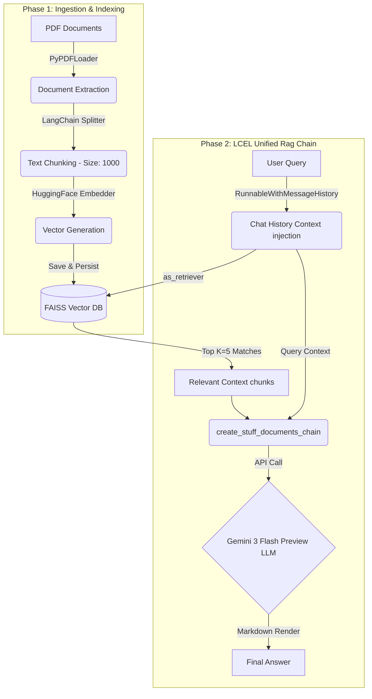

# Comprehensive RAG System Architecture

This document describes the detailed architecture, core pipeline, and software stack used for this Retrieval-Augmented Generation (RAG) implementation.

## Technology Stack & Libraries

The system leverages a powerful stack built primarily around the LangChain ecosystem to orchestrate the flow.

*   **Framework:** `langchain`, `langchain-community`, and `langchain-classic` for end-to-end pipeline orchestration, leveraging LangChain Expression Language (LCEL).
*   **User Interface:** `streamlit` for the dynamic web-based interface (via `app.py`) and a standard Python CLI pipeline (via `main.py`).
*   **Document Ingestion:** `PyPDFLoader` from LangChain natively parses and extracts raw text from complex PDF documents into `Document` objects.
*   **Vector Embeddings:** `sentence-transformers/all-MiniLM-L6-v2` via `langchain-huggingface`. This open-source lightweight model produces dense, highly-performant vector representations of text.
*   **Vector Database:** `faiss-cpu` (Facebook AI Similarity Search) acts as the high-performance local vector store.
*   **Generation (LLM):** `gemini-3-flash-preview` via Google's `langchain-google-genai` integration for inference and summarization.
*   **Memory Management:** `RunnableWithMessageHistory` to persist chat context across conversational turns.

---

## The RAG Pipeline

The architecture is split into two distinct operational phases:

### Phase 1: Ingestion & Indexing Pipeline (Offline/Upload Setup)

This phase transforms raw PDF data into a searchable, mathematical format stored locally.

1.  **PDF Loading & Extraction (`src/ingestion.py`)**
    *   **Process:** User uploads a PDF via the Streamlit interface (saved temporarily) or designates a folder (`data/`) via CLI.
    *   **Library:** Multi-page PDF binary files are natively ingested via LangChain's `PyPDFLoader`. 
    *   **Output:** List of `langchain_core.documents.Document` objects holding text and metadata natively.

2.  **Semantic Text Chunking (`src/chunking.py`)**
    *   **Process:** The raw extracted text is split into semantic units to maximize the contextual efficiency of the LLM and the accuracy of the similarity search.
    *   **Mechanics:** Uses LangChain's `RecursiveCharacterTextSplitter`.
    *   **Configuration:**
        *   **Chunk Size:** `1000` characters (ensures documents are broken down into digestible contextual concepts).
        *   **Chunk Overlap:** `100` characters (prevents hard semantic boundaries by sliding the window slightly backwards, maintaining context across consecutive chunks).
    *   **Output:** Array of smaller, manageable `Document` chunks mapping exact strings seamlessly back to their original document logic via propagated metadata.

3.  **Vector Embedding & FAISS Store Generation (`src/embedding.py`)**
    *   **Process:** Text chunks are transformed into floating-point numerical vectors.
    *   **Embeddings:** LangChain orchestrates `HuggingFaceEmbeddings` processing text through the `all-MiniLM-L6-v2` model.
    *   **Storage Index:** FAISS maps these embeddings into an optimized mathematical index space (saved into `/index_store/faiss_index/...`).

### Phase 2: Retrieval & Generation Pipeline (Online/Real-time Querying)

This phase takes a user prompt, retrieves relevant contexts, and returns a verified LLM response.

1.  **User Inquiry Processing (`app.py` / `main.py`)**
    *   **Process:** Text query is captured from the user inside the Streamlit chat input or CLI terminal.

2.  **Query Embedding (`src/retrieval.py`)**
    *   **Process:** The raw text query is embedded using the exact same Hugging Face `all-MiniLM-L6-v2` model to match the dimensional layout of the FAISS index.

3.  **Semantic Search (FAISS Retrieval)**
    *   **Process:** The VectorStore `as_retriever()` implicitly converts the FAISS index into a LangChain Retriever interface, finding the Top K=5 most contextually relevant chunks.

4.  **Generation Pipeline (`src/generation.py`)**
    *   **Process:** Utilizing LCEL, the application links context aggregation (`create_stuff_documents_chain`) and query linking (`create_retrieval_chain`). 
    *   **Memory:** Contextual injection is powered by wrapping the RAG pipeline in `RunnableWithMessageHistory` to sync past turns of Q&A history alongside the new query natively.
    *   **Output:** The LLM generates the final comprehensive text mapped off the provided context.

---

## Architectural Data Flow Summary

