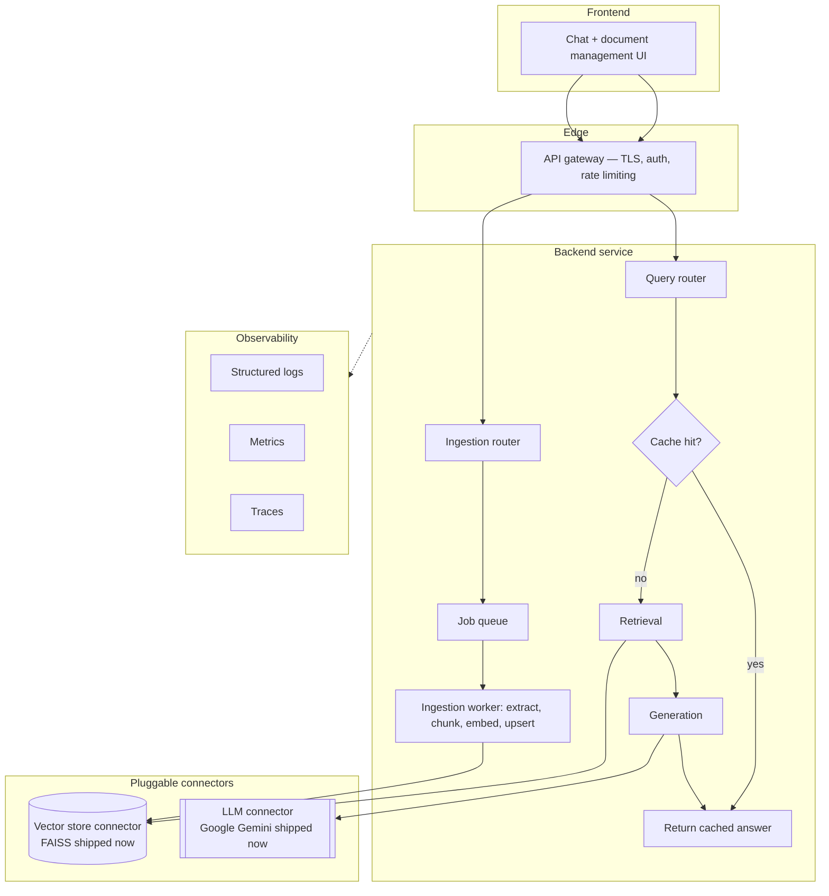

# RAG Framework — Production Build: Master Overview & Index

**Project:** RAG-implementation → `ragframework`
**Document type:** Master index. Read this first — it gives every stage document its shared context so each one can be handed to a different implementer (human or agent) independently.

---

## 1. What we're building

**Current state (the POC we're starting from):** a working local proof-of-concept. A CLI entry point (`main.py`, argparse) loads PDFs via `PyPDFLoader`, chunks them via `RecursiveCharacterTextSplitter`, indexes them in a local FAISS index managed through LangChain, and answers questions via `ChatGoogleGenerativeAI` in a LangChain LCEL chain, with conversation memory held in an in-process `ChatMessageHistory`. There is no API layer, no auth, no logging beyond `print()`, no observability, and a single global session.

**Target state (what this build produces):** a *framework*, not a hosted product, where:

- Any adopter can plug in **their own vector database**.
- Any adopter can plug in **their own LLM API key**.
- The framework supplies ingestion, chunking, retrieval, generation, and memory as a fixed **core**.
- The framework supplies a backend service (routing, caching, logging, auth, reliability), a reference frontend, and observability as **runnable scaffolding** — the adopter runs all of it on their own infrastructure, with their own credentials. We never operate this for them.

**Connector scope for this entire build:** the abstraction layer is designed to support arbitrary vector stores and LLM providers, but only **two concrete connectors are implemented**:

- **FAISS** — vector store connector
- **Google Gemini** — LLM connector

Every other backend (pgvector, Qdrant, Pinecone, Weaviate, OpenAI, Anthropic, etc.) is an intentional, documented extension point. The interfaces are designed so adding one later means writing one new class and registering it — never touching core code. Do not implement any connector beyond these two in this build, in any stage, no matter how easy it looks.

---

## 2. High-level architecture

**Query path:** frontend → gateway (auth, rate limit) → query router → cache check → on miss, retrieval against the configured vector store connector → generation against the configured LLM connector → answer streamed back → cache write.

**Ingestion path:** frontend upload → gateway → ingestion router → job enqueued → worker extracts text, chunks it, embeds it, and upserts into the configured vector store connector → status polled or pushed back to the frontend.

---

## 3. Guiding principles (apply to every stage, no exceptions)

1. **Bring your own backend.** The framework never assumes a specific vector database or LLM vendor beyond the two connectors it ships. Credentials and infrastructure choices stay with the adopter.
2. **Interface first, implementation second.** Every backend concern — storage, generation, cache, memory — is defined as an abstract contract before a concrete class is written against it.
3. **Sane defaults, everything swappable.** Out of the box: FAISS locally, Gemini for generation, in-memory cache and memory. Every one of those has a documented seam to replace it later.
4. **Observability and reliability are not an afterthought.** Logging, tracing, retries, and health checks are built into the core and the connector layer from day one, not bolted on per-connector later.
5. **The framework is not a hosted service.** It ships a reference backend, a reference frontend, Docker templates, and documentation. The adopter runs it on their own infrastructure with their own credentials — you are not operating it for them.

---

## 4. Baseline assumptions — correctness fixes (already implemented)

Every stage document in this build assumes the following bugs from the original POC are **already fixed**. None of the stage documents ask you to redo this work, but several stages depend on this baseline being true.

| # | Location | Fixed issue |
|---|---|---|
| 1 | `src/ingestion.py` | PDF load errors are caught by specific exception types, logged, and surfaced as a per-file status — no more bare `except: pass`. |
| 2 | `main.py` / query path | `session_id` comes from the caller; each session gets its own `ChatMessageHistory`, not a shared global keyed to `"cli_session"`. |
| 3 | `src/embedding.py` | `FAISS.load_local(..., allow_dangerous_deserialization=True)` is retained but documented as a known, accepted constraint specific to the FAISS connector — not silently carried forward as an unexamined risk. |
| 4 | `src/embedding.py`, `src/generation.py` | The embedding model and LLM singletons are no longer unlocked lazy globals — they're guarded by a lock or lifespan-managed initialization. |
| 5 | `main.py` vs `src/chunking.py` | Chunk size/overlap defaults no longer disagree (previously 1000/100 vs 2500/250) — there is one source of truth. |
| 6 | Repo root | `index_store/faiss_index.idx` and `index_store/text_chunks.json` are removed from git and `.gitignore`'d — they're runtime artifacts, not framework assets. |
| 7 | `src/chunking.py`, `src/utils.py` | Dead code (`save_chunks_to_json`, `load_chunks_from_json`, `save_text_chunks`, `load_text_chunks`) is deleted. |

If you (or an agent) pick up a single stage document in isolation, treat this table as ground truth about the state of the codebase you're inheriting.

---

## 5. How to use these documents

Each stage document is **self-contained** — it repeats the project context, guiding principles, and baseline assumptions above so it can be handed to a different implementer without needing this file. The intended reading/build order is the file order below; each stage assumes the previous stages are complete and each ends with a "handoff" note describing exactly what the next stage will build on.

| # | Document | Covers (source roadmap section) | One-line scope |
|---|---|---|---|
| 1 | `01-foundation-repo-restructure-and-connector-contracts.md` | §5, §6.1, §6.2, §6.4 | Restructure the repo into the framework layout; define `BaseVectorStore` and `BaseLLMProvider` as abstract contracts. |
| 2 | `02-connector-implementations-faiss-gemini-and-config.md` | §6.3, §6.5, §7 | Port the existing FAISS and Gemini logic onto the contracts; build the `Settings` model and connector registries. |
| 3 | `03-backend-api-routing-and-schemas.md` | §8 | Stand up the FastAPI app: versioned routers, Pydantic schemas, streaming-aware routing. |
| 4 | `04-caching-and-memory-layer.md` | §9 | Query/answer cache, embedding cache, warm-model cache, and the swappable session-memory abstraction. |
| 5 | `05-structured-logging-and-correlation-ids.md` | §10 | Replace all `print()` with structured JSON logging, request-ID propagation, redaction rules. |
| 6 | `06-authorization-and-rate-limiting.md` | §11 | Optional API-key auth with scopes, rate limiting, multi-tenancy pattern. |
| 7 | `07-async-ingestion-pipeline.md` | §12 | Move ingestion off the request path onto a job queue with status polling. |
| 8 | `08-reliability-retries-timeouts-streaming.md` | §13 | Retries, timeouts, streaming, token budget guard, fail-fast startup config checks. |
| 9 | `09-observability-metrics-tracing-health.md` | §14 | OpenTelemetry metrics/tracing, health/readiness endpoints, RAG-specific tracing, cost tracking. |
| 10 | `10-frontend-reference-ui.md` | §15 | Reference React/TypeScript frontend: chat, document management, settings pages. |
| 11 | `11-security-hardening.md` | §16 | Upload validation, secret redaction, TLS/CORS, least-privilege credentials. |
| 12 | `12-testing-strategy.md` | §17 | Contract tests parametrized over every registered connector, plus unit/integration tests. |
| 13 | `13-deployment-and-cicd.md` | §18 | Per-service Dockerfiles, docker-compose reference deployment, CI pipeline. |
| 14 | `14-documentation-versioning-distribution.md` | §19 | README, per-connector setup guide, semantic versioning, packaging, publish target. |

The original roadmap's Section 2 ("Correctness fixes — do first") is not a separate document here because it is assumed already implemented (see Section 4 above). Its **outcomes** are folded into the relevant stage documents wherever they matter (e.g., the singleton-locking fix reappears in the caching stage; the chunk-size fix reappears in the config stage).

The original roadmap's Appendix (environment variables and API reference) is not a separate document either — each variable and endpoint is documented in the stage document that owns it, so the reference material lives next to the implementation it describes instead of in a disconnected appendix.

---

## 6. Cross-cutting rules that apply regardless of which stage you're implementing

- **Never** implement a third vector store or LLM connector "while you're in there." Extension points are documented, not built, in this phase.
- **Never** let core logic (`ragframework/core/*`) import a concrete connector class directly. It must only ever go through `get_vector_store(settings)` / `get_llm(settings)`.
- **Never** let secrets (API keys, credentials) reach a log line, an HTTP response, or a frontend state that isn't in-memory.
- **Never** hardcode a specific observability vendor, log destination, or cloud provider into framework code — these are adopter-configured.
- **Always** treat a breaking change to `BaseVectorStore` or `BaseLLMProvider` as a major-version-bump-worthy event, even during initial development — get the contracts right in Stage 1 rather than patching them repeatedly later.
- **Always** default to the safest/simplest behavior when a feature is optional (auth off by default, Redis off by default, tracing off by default) — the framework should run with zero external dependencies out of the box.
